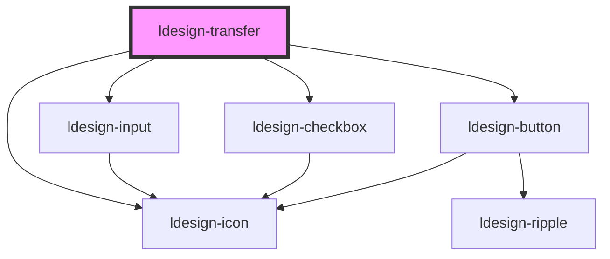

# ldesign-transfer

<!-- Auto Generated Below -->

## Overview

Transfer 穿梭框
支持左右两栏列表，通过按钮将条目在两侧移动。

## Properties

| Property       | Attribute       | Description         | Type                       | Default     |
| -------------- | --------------- | ------------------- | -------------------------- | ----------- |
| `defaultValue` | `default-value` | 默认值（非受控）            | `string[]`                 | `undefined` |
| `disabled`     | `disabled`      | 禁用整个组件              | `boolean`                  | `false`     |
| `filterable`   | `filterable`    | 是否可搜索               | `boolean`                  | `false`     |
| `items`        | `items`         | 数据源（可传数组或 JSON 字符串） | `TransferItem[] \| string` | `[]`        |
| `leftTitle`    | `left-title`    | 左侧面板标题              | `string`                   | `'源列表'`     |
| `listHeight`   | `list-height`   | 列表高度（px）            | `number`                   | `240`       |
| `rightTitle`   | `right-title`   | 右侧面板标题              | `string`                   | `'目标列表'`    |
| `value`        | `value`         | 目标列表值（受控）           | `string[]`                 | `undefined` |

## Events

| Event           | Description | Type                                                                                   |
| --------------- | ----------- | -------------------------------------------------------------------------------------- |
| `ldesignChange` | 值改变事件       | `CustomEvent<{ value: string[]; movedKeys: string[]; direction: "left" \| "right"; }>` |

## Dependencies

### Depends on

- [ldesign-input](../input)
- [ldesign-checkbox](../checkbox)
- [ldesign-button](../button)
- [ldesign-icon](../icon)

### Graph

----------------------------------------------

*Built with [StencilJS](https://stenciljs.com/)*
