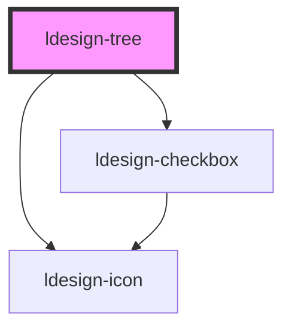

# ldesign-tree

<!-- Auto Generated Below -->

## Properties

| Property              | Attribute               | Description                                                       | Type                                                                                                              | Default     |
| --------------------- | ----------------------- | ----------------------------------------------------------------- | ----------------------------------------------------------------------------------------------------------------- | ----------- |
| `allowAfter`          | `allow-after`           |                                                                   | `boolean`                                                                                                         | `true`      |
| `allowBefore`         | `allow-before`          | 全局允许放置位置                                                          | `boolean`                                                                                                         | `true`      |
| `allowDrag`           | --                      | 自定义：是否允许拖拽该节点（JS 赋值）                                              | `(node: TreeNode) => boolean`                                                                                     | `undefined` |
| `allowDrop`           | --                      | 自定义：是否允许在目标位置放置（JS 赋值）                                            | `(dragNode: TreeNode, dropNode: TreeNode, position: "after" \| "before" \| "inside") => boolean`                  | `undefined` |
| `allowInside`         | `allow-inside`          |                                                                   | `boolean`                                                                                                         | `true`      |
| `checkable`           | `checkable`             | 是否显示复选框                                                           | `boolean`                                                                                                         | `false`     |
| `checkedKeys`         | `checked-keys`          | 当前勾选项（受控）                                                         | `string \| string[]`                                                                                              | `undefined` |
| `dataUrl`             | `data-url`              | 远程数据 URL（根或子节点懒加载）                                                | `string`                                                                                                          | `undefined` |
| `defaultCheckedKeys`  | `default-checked-keys`  | 默认勾选项（非受控）                                                        | `string \| string[]`                                                                                              | `[]`        |
| `defaultExpandedKeys` | `default-expanded-keys` | 默认展开项（非受控）                                                        | `string \| string[]`                                                                                              | `[]`        |
| `defaultValue`        | `default-value`         | 默认选中项（非受控）                                                        | `string \| string[]`                                                                                              | `undefined` |
| `dragExpandDelay`     | `drag-expand-delay`     | 拖拽悬停自动展开的延迟（毫秒）                                                   | `number`                                                                                                          | `400`       |
| `expandedKeys`        | `expanded-keys`         | 当前展开项（受控）                                                         | `string \| string[]`                                                                                              | `undefined` |
| `fieldMap`            | `field-map`             | 字段映射：当后端字段名非 key/label/children/isLeaf 等时可用；支持 JSON 字符串或对象（JS 赋值） | `string \| { key: string; label: string; children?: string; isLeaf?: string; disabled?: string; icon?: string; }` | `undefined` |
| `indent`              | `indent`                | 层级缩进（px）                                                          | `number`                                                                                                          | `16`        |
| `items`               | `items`                 | 树数据（可传入 JSON 字符串或对象数组）                                            | `TreeNode[] \| string`                                                                                            | `[]`        |
| `itemsSelector`       | `items-selector`        | 选择器：读取 <script type="application/json"> 的数据                       | `string`                                                                                                          | `undefined` |
| `lazy`                | `lazy`                  | 启用懒加载：展开时若无 children 则触发加载                                        | `boolean`                                                                                                         | `false`     |
| `loadData`            | --                      | 可通过 JS 赋值：自定义加载函数                                                 | `(node?: TreeNode) => Promise<TreeNode[]>`                                                                        | `undefined` |
| `maxDepth`            | `max-depth`             | 限制最大层级深度（根为 depth=1）；未设置则不限制                                      | `number`                                                                                                          | `undefined` |
| `multiple`            | `multiple`              | 是否多选                                                              | `boolean`                                                                                                         | `false`     |
| `nodeDraggable`       | `node-draggable`        | 是否开启节点拖拽重排                                                        | `boolean`                                                                                                         | `false`     |
| `parentParam`         | `parent-param`          | 懒加载参数名（dataUrl 模式下）：父键参数                                          | `string`                                                                                                          | `'parent'`  |
| `reorderable`         | `reorderable`           | 是否启用键盘重排（Alt+方向键）                                                 | `boolean`                                                                                                         | `true`      |
| `selectable`          | `selectable`            | 是否可选择（高亮）                                                         | `boolean`                                                                                                         | `true`      |
| `showLine`            | `show-line`             | 是否显示连接线（简易）                                                       | `boolean`                                                                                                         | `false`     |
| `transform`           | --                      | 可通过 JS 赋值：转换函数，将接口原始数据转换为 TreeNode[]                              | `(raw: any) => TreeNode[]`                                                                                        | `undefined` |
| `value`               | `value`                 | 当前选中项（受控，单选为 string，多选为 string[]）                                 | `string \| string[]`                                                                                              | `undefined` |

## Events

| Event           | Description           | Type                                                                                                               |
| --------------- | --------------------- | ------------------------------------------------------------------------------------------------------------------ |
| `ldesignCheck`  | 勾选事件（包含半选）            | `CustomEvent<{ key: string; checked: boolean; checkedKeys: string[]; halfCheckedKeys: string[]; }>`                |
| `ldesignDrop`   | 拖拽放置事件（也用于键盘重排时回调）    | `CustomEvent<{ dragKey: string; dropKey: string; position: "after" \| "before" \| "inside"; items: TreeNode[]; }>` |
| `ldesignExpand` | 展开/收起事件               | `CustomEvent<{ key: string; expanded: boolean; expandedKeys: string[]; }>`                                         |
| `ldesignMove`   | 键盘重排事件（与 drop 事件区分来源） | `CustomEvent<{ dragKey: string; dropKey: string; position: "after" \| "before" \| "inside"; items: TreeNode[]; }>` |
| `ldesignSelect` | 选中事件                  | `CustomEvent<{ key: string; keys: string[]; node?: TreeNode; }>`                                                   |

## Methods

### `collapse(key: string) => Promise<void>`

#### Parameters

| Name  | Type     | Description |
| ----- | -------- | ----------- |
| `key` | `string` |             |

#### Returns

Type: `Promise<void>`

### `collapseAll() => Promise<void>`

#### Returns

Type: `Promise<void>`

### `expand(key: string) => Promise<void>`

#### Parameters

| Name  | Type     | Description |
| ----- | -------- | ----------- |
| `key` | `string` |             |

#### Returns

Type: `Promise<void>`

### `expandAll() => Promise<void>`

#### Returns

Type: `Promise<void>`

### `focusKey(key: string) => Promise<void>`

#### Parameters

| Name  | Type     | Description |
| ----- | -------- | ----------- |
| `key` | `string` |             |

#### Returns

Type: `Promise<void>`

### `getItems() => Promise<TreeNode[]>`

#### Returns

Type: `Promise<TreeNode[]>`

### `move(dragKey: string, dropKey: string, position: "before" | "after" | "inside") => Promise<boolean>`

#### Parameters

| Name       | Type                              | Description |
| ---------- | --------------------------------- | ----------- |
| `dragKey`  | `string`                          |             |
| `dropKey`  | `string`                          |             |
| `position` | `"after" \| "before" \| "inside"` |             |

#### Returns

Type: `Promise<boolean>`

### `setItems(items: string | TreeNode[]) => Promise<void>`

#### Parameters

| Name    | Type                   | Description |
| ------- | ---------------------- | ----------- |
| `items` | `string \| TreeNode[]` |             |

#### Returns

Type: `Promise<void>`

## Dependencies

### Depends on

- [ldesign-icon](../icon)
- [ldesign-checkbox](../checkbox)

### Graph

----------------------------------------------

*Built with [StencilJS](https://stenciljs.com/)*
