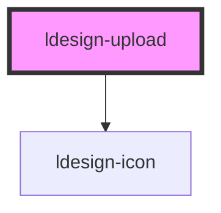

# ldesign-upload

<!-- Auto Generated Below -->

## Overview

Upload 文件上传组件

## Properties

| Property   | Attribute   | Description | Type      | Default     |
| ---------- | ----------- | ----------- | --------- | ----------- |
| `accept`   | `accept`    | 接受的文件类型     | `string`  | `undefined` |
| `disabled` | `disabled`  | 是否禁用        | `boolean` | `false`     |
| `drag`     | `drag`      | 是否支持拖拽上传    | `boolean` | `false`     |
| `maxCount` | `max-count` | 最大文件数量      | `number`  | `undefined` |
| `maxSize`  | `max-size`  | 最大文件大小（字节）  | `number`  | `undefined` |
| `multiple` | `multiple`  | 是否支持多选      | `boolean` | `false`     |

## Events

| Event                 | Description | Type                                                  |
| --------------------- | ----------- | ----------------------------------------------------- |
| `ldesignBeforeUpload` | 文件上传前事件     | `CustomEvent<File>`                                   |
| `ldesignChange`       | 文件选择事件      | `CustomEvent<UploadFile[]>`                           |
| `ldesignError`        | 上传失败事件      | `CustomEvent<{ file: UploadFile; error: any; }>`      |
| `ldesignProgress`     | 上传进度事件      | `CustomEvent<{ file: UploadFile; percent: number; }>` |
| `ldesignSuccess`      | 上传成功事件      | `CustomEvent<UploadFile>`                             |

## Dependencies

### Depends on

- [ldesign-icon](../icon)

### Graph

----------------------------------------------

*Built with [StencilJS](https://stenciljs.com/)*
